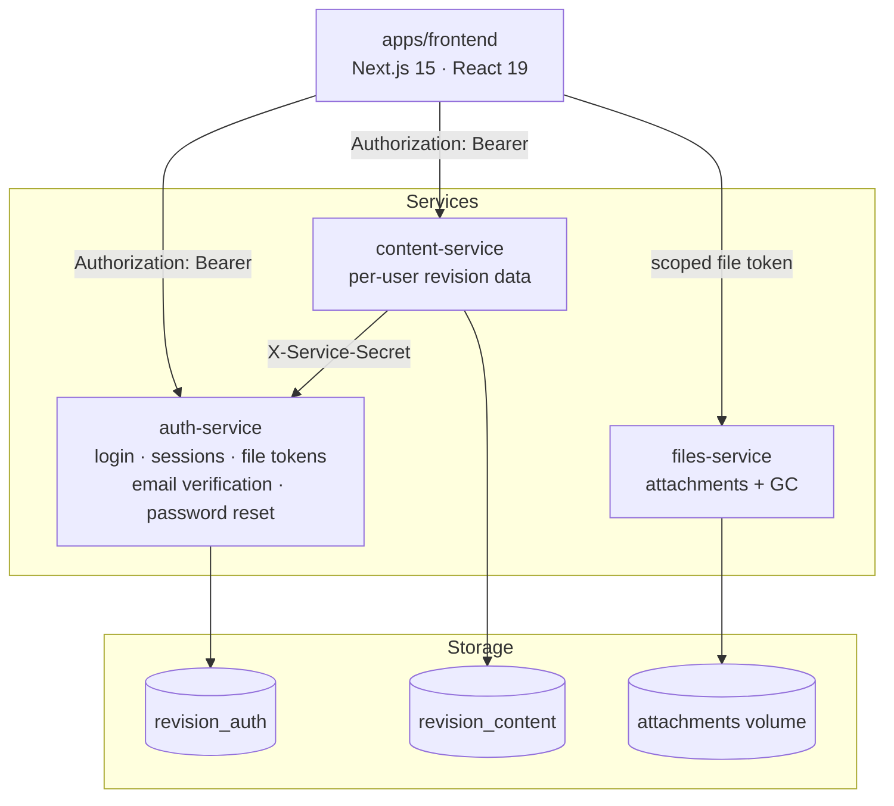
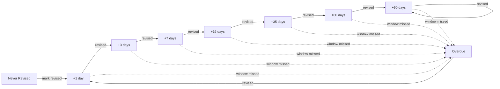
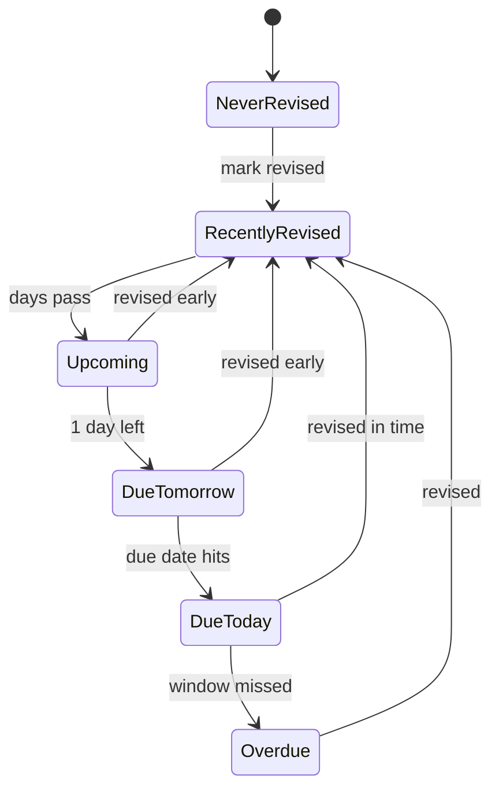

# RevisionWorks


An exam-revision manager for any subject syllabus content, built around spaced-repetition scheduling. Each user tracks their own subjects → chapters → topics, marks what they've revised, and the app tells them what's due next — then charts how consistently they're keeping up. Runs in the browser and installs as a standalone app on phones and desktops (also packaged for the Play Store as a Trusted Web Activity).

## Architecture



The one exception to "frontend never touches Postgres, services never touch each other" is the coaching dashboard: `content-service` calls `auth-service`'s internal roster API (authenticated with a shared `SERVICE_SECRET` via the `X-Service-Secret` header) to resolve which students belong to a cohort before it aggregates their revision stats.

The frontend never touches Postgres directly — every request goes over HTTP to one of the three services, each owning its own database and its own migrations under `services/*/db/migrations`. `packages/shared` holds types used across all of them.

Design specs and implementation plans for how this evolved (single Next.js app → multi-user → Postgres → microservices split) live under `docs/superpowers/specs/` and `docs/superpowers/plans/`.

## How revision scheduling works

Every topic climbs a fixed interval ladder each time it's marked revised. Miss the window and it drops straight to `Overdue`:



Each topic's badge is one of six states, driven purely by how many days remain until its next due date:



## Features

| Area | What it does |
|---|---|
| **Revision engine** | Spaced-repetition ladder above, computed in `lib/revision/engine.ts` + `ladder.ts` |
| **Content browsing** | Subject → chapter → topic hierarchy, plus archive and filtered/search views |
| **Insights** | Personal statistics at `/insights` — completion gauge, status breakdown, a 365-day revision heatmap, current/longest streaks, and most/least-revised topic rankings |
| **Calendar** | Due/overdue topics laid out as an agenda list or a month grid at `/calendar` |
| **Rich markdown editor** | Markdown, GFM, KaTeX math, syntax-highlighted code (`react-markdown`, `rehype-katex`, `rehype-highlight`) |
| **Attachments** | Per-topic file/image uploads, served via scoped file tokens — a leaked file URL can't be replayed against the rest of the API |
| **In-app previews** | Images and PDFs preview inline in a modal, with first-page PDF thumbnails; uploaded PDFs can be auto-inserted into a topic's notes |
| **Bookmarks & tags** | Tag-based filtering, search, and a dedicated bookmarks view |
| **Drag-and-drop** | Reordering via `@dnd-kit` |
| **Multi-user auth** | Per-user accounts scoped to an engineering domain (civil, mechanical, electrical), fully isolated data and file storage per user; account/email/password managed at `/settings` |
| **Coaching dashboard** | Organisations → groups with invite-code joining; heads/admins see cohort completion, activity, per-student drill-down (revision status only — notes/attachments stay private) at `/coaching` |
| **Installable app** | Web App Manifest + service-worker-ready build — "Add to Home Screen" on any device, and shipped to the Play Store as a Trusted Web Activity |
| **AI flashcard generation** | Generate flashcards for a topic from its notes via Gemini, review and keep/discard each before saving; the classic flip-through card review is now a self-graded quiz that feeds the revision ladder — see below |

## AI flashcard generation

A **Generate** button on a topic's flashcards panel (disabled until the topic has notes) sends that topic's title and notes to a Gemini model and proposes a batch of flashcards. Generated cards land in a **review step** — the student keeps or discards each one individually, and only the kept cards are saved; nothing is written automatically. The existing flip-through card review is now a **self-graded quiz** (*Got it* / *Missed it*): finishing a session records one revision carrying the session's score, and a weak score nudges the ladder toward an earlier suggested next revision date.

### Why generated cards are reviewed, never auto-saved

A free-tier model occasionally produces a weak or wrong card, and inside a spaced-repetition system a wrong card gets *rehearsed* — repeated and reinforced on a schedule — which is worse than having no card at all. The review step doubles as a free quality signal: how many of the proposed cards a student actually keeps is logged against every generation (`cards_proposed` vs `cards_kept`, see the runbook below).

### Why the quiz is graded locally

Grading is a self-tap, not a model call: no LLM request, no per-request cost, and it runs instantly with the app offline. It only ever *suggests* a next revision date — `plannedAt` stays user-owned, in keeping with the app's manual-first scheduling described above; the quiz informs the ladder, it never overrides the student.

### Architecture

A fourth service, `ai-service` (port `4004`, own database `revision_ai`), holds the provider API key, a per-user daily quota, and a circuit breaker against a rate-limited provider. `apps/frontend` proxies the browser to it through `/api/ai/flashcards` and `/api/ai/flashcards/kept`; accepted cards are then saved through the existing content-service path, so `ai-service` itself never touches `app_data`.

### Configuration

| Variable | Set on | Purpose |
|---|---|---|
| `GEMINI_API_KEY_REVISION` | `.env` → `ai-service` | Gemini API key — **see warning below** |
| `AI_DAILY_QUOTA` | `.env` → `ai-service` | Per-user daily generation cap (default `10`) |
| `AI_SERVICE_URL` | `app` | `http://ai-service:4004` — how the frontend reaches ai-service |
| `DATABASE_URL` (ai-service's own) | `ai-service` | `postgres://revision:***@db:5432/revision_ai` — set independently of the other services' `DATABASE_URL`, same pattern as auth-service/content-service |

`ai-service` also reuses the `SESSION_SECRET` and `SERVICE_SECRET` already configured for the other services.

**Warning — use a separate Google Cloud project.** `GEMINI_API_KEY_REVISION` must come from its own Google Cloud project, never one shared with another Gemini-using app on the same host (for example a key already used by another AI project). Google's free-tier rate limits are per-project: a shared key means a busy neighbouring app throttles students mid-revision, and a busy revision session throttles that other app right back.

**Privacy note.** On Gemini's free tier, submitted content may be used by Google to improve their products, and a student's topic notes are sent to the model in order to generate cards. Tell users this before the feature is turned on for them.

### The model ID is a maintenance trap

ai-service currently targets **`gemini-3.6-flash`**, set in exactly one place: `services/ai-service/src/provider/gemini.ts`. Model IDs get retired — this feature originally targeted `gemini-2.5-flash`, which now returns HTTP 404 ("no longer available to new users") from Google. When generation starts failing with a 404, that file is the first and only place to look.

### Deploying and operating

See [`docs/ai-flashcards-deployment.md`](docs/ai-flashcards-deployment.md) for getting a key, creating the `revision_ai` database on an existing deployment, rehearsing safely in the isolated preview stack, deploying for real, reading the usage/quota data, and troubleshooting provider errors.

## Getting started

```bash
cp .env.example .env
openssl rand -hex 32          # paste into SESSION_SECRET
openssl rand -hex 32          # paste into SERVICE_SECRET (content-service -> auth-service roster calls)
# fill in POSTGRES_PASSWORD, then:
docker volume create revision_app-db
docker volume create revision_files-data
docker compose up -d
# one-off: backfill revision stats for users who existed before the coaching dashboard
docker compose exec content-service npm run backfill:stats
```

App → `http://127.0.0.1:3200` · Postgres → `127.0.0.1:5433` (for migrations/tests run outside Docker). Full variable breakdown, including per-service `DATABASE_URL` overrides, is in `.env.example`.

## Testing

```bash
npm test              # per-workspace Vitest suites
npx tsc --noEmit      # type check
npm run lint          # lint
```

### Mobile audit

```bash
node apps/frontend/scripts/mobile-audit.mjs [baseUrl]   # defaults to http://127.0.0.1:3200
```

Drives the **running** stack in a phone-sized Chromium and fails (non-zero exit)
on any of the regressions the mobile passes fixed: horizontal overflow at
320–430px, touch targets under 44px, overlapping hit areas, form fields under
16px (iOS zoom-lock), landscape breakage, the app shell being withheld during
hydration, and missing focus rings.

Needs a seeded `demo` account (`node scripts/seed-demo-user.mjs`) — override with
`AUDIT_USER` / `AUDIT_PASS`. Playwright is deliberately not a dependency of the
app; install it once with `npx playwright@latest install chromium`, or point
`PLAYWRIGHT_PATH` at an existing module.

Targets measured as under 44px that are genuinely fine get a documented entry in
`TARGET_EXCEPTIONS` inside the script — each one must carry a reason.

## Also on the roadmap

- **Notifications** — reminders when a topic becomes due
- **Google Sign-In** — Phase 2 of account/email work; builds on the email verification + password reset shipped in auth-service (Resend behind an `EmailSender` seam; with `RESEND_API_KEY` unset, links are logged to auth-service stdout instead of emailed)
- **Public `/about` page** — a marketing/intro landing page for the app (design spec under `docs/superpowers/specs/`)
