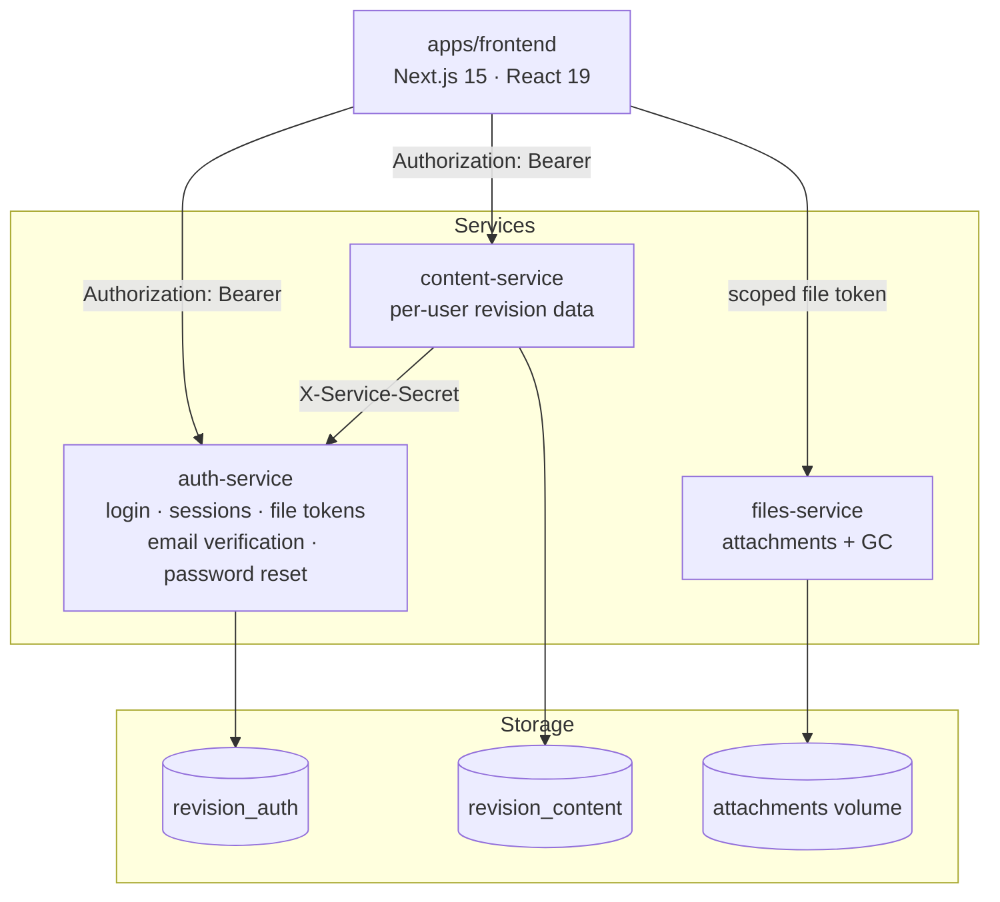
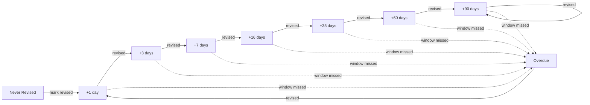
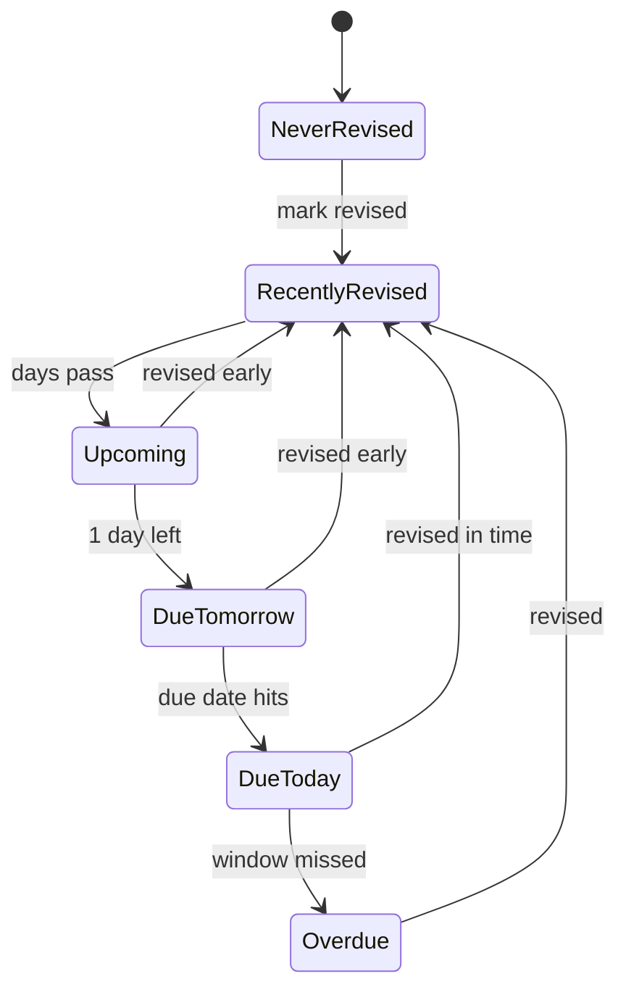

# Revision App


A personal exam-revision manager for civil engineering (ESE) syllabus content, built around spaced-repetition scheduling. Each user tracks their own subjects → chapters → topics, marks what they've revised, and the app tells them what's due next.

## Architecture



The one exception to "frontend never touches Postgres, services never touch each other" is the coaching dashboard: `content-service` calls `auth-service`'s internal roster API (authenticated with a shared `SERVICE_SECRET` via the `X-Service-Secret` header) to resolve which students belong to a cohort before it aggregates their revision stats.

The frontend never touches Postgres directly — every request goes over HTTP to one of the three services, each owning its own database and its own migrations under `services/*/db/migrations`. `packages/shared` holds types used across all of them.

Design specs and implementation plans for how this evolved (single Next.js app → multi-user → Postgres → microservices split) live under `docs/superpowers/specs/` and `docs/superpowers/plans/`.

## How revision scheduling works

Every topic climbs a fixed interval ladder each time it's marked revised. Miss the window and it drops straight to `Overdue`:



Each topic's badge is one of six states, driven purely by how many days remain until its next due date:



## Features

| Area | What it does |
|---|---|
| **Revision engine** | Spaced-repetition ladder above, computed in `lib/revision/engine.ts` + `ladder.ts` |
| **Content browsing** | Subject → chapter → topic hierarchy, plus archive and filtered/search views |
| **Rich markdown editor** | Markdown, GFM, KaTeX math, syntax-highlighted code (`react-markdown`, `rehype-katex`, `rehype-highlight`) |
| **Attachments** | Per-topic file/image uploads, served via scoped file tokens — a leaked file URL can't be replayed against the rest of the API |
| **Bookmarks & tags** | Tag-based filtering, search, and a dedicated bookmarks view |
| **Drag-and-drop** | Reordering via `@dnd-kit` |
| **Multi-user auth** | Per-user accounts scoped to an engineering domain (civil, mechanical, electrical), fully isolated data and file storage per user |
| **Coaching dashboard** | Organisations → groups with invite-code joining; heads/admins see cohort completion, activity, per-student drill-down (revision status only — notes/attachments stay private) at `/coaching` |

## Getting started

```bash
cp .env.example .env
openssl rand -hex 32          # paste into SESSION_SECRET
openssl rand -hex 32          # paste into SERVICE_SECRET (content-service -> auth-service roster calls)
# fill in POSTGRES_PASSWORD, then:
docker volume create revision_app-db
docker volume create revision_files-data
docker compose up -d
# one-off: backfill revision stats for users who existed before the coaching dashboard
docker compose exec content-service npm run backfill:stats
```

App → `http://127.0.0.1:3200` · Postgres → `127.0.0.1:5433` (for migrations/tests run outside Docker). Full variable breakdown, including per-service `DATABASE_URL` overrides, is in `.env.example`.

## Testing

```bash
npm test              # per-workspace Vitest suites
npx tsc --noEmit      # type check
npm run lint          # lint
```

## Also on the roadmap

- **Personal statistics dashboard** — the single-student version of the activity chart above, which the coaching dashboard builds on
- **Calendar view** — due/overdue topics laid out on a calendar
- **Notifications** — reminders when a topic becomes due
- **Google Sign-In** — Phase 2 of account/email work; builds on the email verification + password reset shipped in auth-service (Resend behind an `EmailSender` seam; with `RESEND_API_KEY` unset, links are logged to auth-service stdout instead of emailed)
