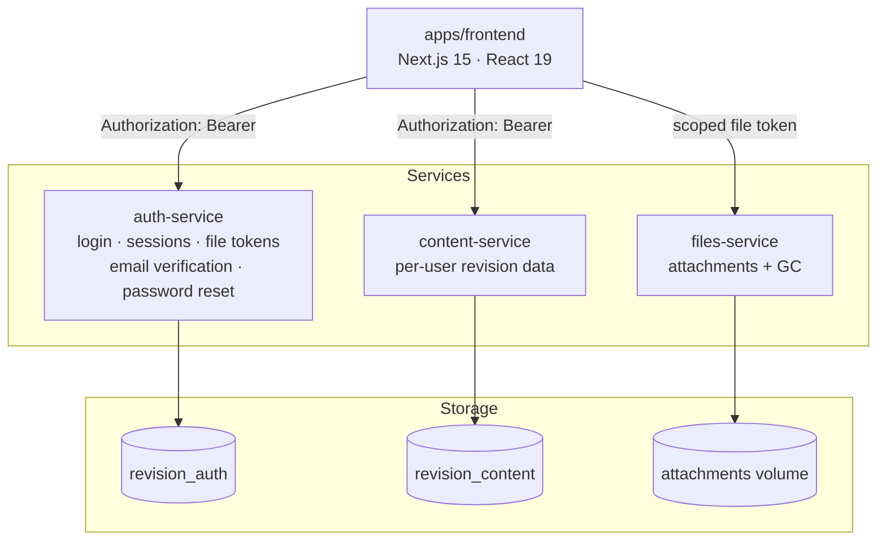
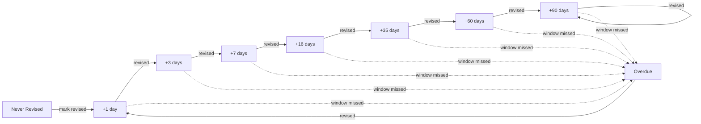
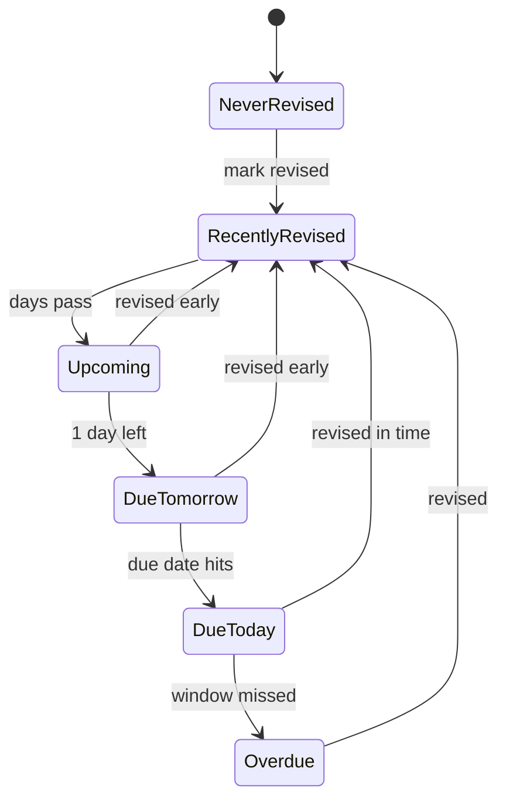

# Revision App


A personal exam-revision manager for civil engineering (ESE) syllabus content, built around spaced-repetition scheduling. Each user tracks their own subjects → chapters → topics, marks what they've revised, and the app tells them what's due next.

## Architecture



The frontend never touches Postgres directly — every request goes over HTTP to one of the three services, each owning its own database and its own migrations under `services/*/db/migrations`. `packages/shared` holds types used across all of them.

Design specs and implementation plans for how this evolved (single Next.js app → multi-user → Postgres → microservices split) live under `docs/superpowers/specs/` and `docs/superpowers/plans/`.

## How revision scheduling works

Every topic climbs a fixed interval ladder each time it's marked revised. Miss the window and it drops straight to `Overdue`:



Each topic's badge is one of six states, driven purely by how many days remain until its next due date:



## Features

| Area | What it does |
|---|---|
| **Revision engine** | Spaced-repetition ladder above, computed in `lib/revision/engine.ts` + `ladder.ts` |
| **Content browsing** | Subject → chapter → topic hierarchy, plus archive and filtered/search views |
| **Rich markdown editor** | Markdown, GFM, KaTeX math, syntax-highlighted code (`react-markdown`, `rehype-katex`, `rehype-highlight`) |
| **Attachments** | Per-topic file/image uploads, served via scoped file tokens — a leaked file URL can't be replayed against the rest of the API |
| **Bookmarks & tags** | Tag-based filtering, search, and a dedicated bookmarks view |
| **Drag-and-drop** | Reordering via `@dnd-kit` |
| **Multi-user auth** | Per-user accounts scoped to an engineering domain (civil, mechanical, electrical), fully isolated data and file storage per user |

## Getting started

```bash
cp .env.example .env
openssl rand -hex 32          # paste into SESSION_SECRET
# fill in POSTGRES_PASSWORD, then:
docker volume create revision_app-db
docker volume create revision_files-data
docker compose up -d
```

App → `http://127.0.0.1:3200` · Postgres → `127.0.0.1:5433` (for migrations/tests run outside Docker). Full variable breakdown, including per-service `DATABASE_URL` overrides, is in `.env.example`.

## Testing

```bash
npm test              # per-workspace Vitest suites
npx tsc --noEmit      # type check
npm run lint          # lint
```

## Roadmap: Coaching Dashboard

Not yet built. A `head`/coach role that sees a cohort-wide view instead of just their own data — today every query in `content-service` is scoped to the requesting user by design, so this needs a role field on `users`, an authorization check gating the aggregate endpoints, and read-only cross-user queries.

Rough mockup of the intended layout:

```
┌─────────────────────────────────────────────────────────────────┐
│  Coaching Dashboard                              cohort: civil  │
├─────────────────────────────────────────────────────────────────┤
│  Cohort completion            Due today        Overdue          │
│  ████████████░░░░  68%             12               5           │
├─────────────────────────────────────────────────────────────────┤
│  Revision activity (last 30 days)                                │
│  30│                                     ▄▄                      │
│  20│                    ▄▄        ▄▄     ██   ▄▄                │
│  10│   ▄▄        ▄▄     ██  ▄▄    ██  ▄▄ ██   ██     ▄▄         │
│   0└───██────▄▄───██──▄▄██──██──▄▄██──██─██──▄▄██────██──────▶  │
│        W1     W2      W3      W4      W5     W6     W7          │
├─────────────────────────────────────────────────────────────────┤
│  Student           Completion   Streak   Status                 │
│  ─────────────────────────────────────────────────────          │
│  A. Sharma         ████████░░ 82%   12d   ● On track             │
│  R. Verma          ██████░░░░ 61%    3d   ● On track             │
│  P. Nair           ███░░░░░░░ 34%    0d   ● Overdue (4 topics)   │
│  ...                                              [drill-down →] │
├─────────────────────────────────────────────────────────────────┤
│  Subject/chapter coverage heatmap                                │
│         Soil Mech  Structures  Hydraulics  Transport             │
│  Sharma   ▓▓▓▓▓        ▓▓▓▓░       ▓▓▓░░       ▓▓▓▓▓             │
│  Verma    ▓▓▓░░        ▓▓▓▓▓       ▓▓░░░       ▓▓▓░░             │
│  Nair     ▓░░░░        ▓▓░░░       ▓░░░░       ▓▓░░░             │
└─────────────────────────────────────────────────────────────────┘
```

Planned components:
- Cohort completion %, streaks, and due/overdue counts (rollup of each student's existing badge states)
- Time-series chart of cohort-wide revision activity
- Per-student summary table with drill-down into their full history
- Subject/chapter coverage heatmap across the cohort

## Also on the roadmap

- **Personal statistics dashboard** — the single-student version of the activity chart above, which the coaching dashboard builds on
- **Calendar view** — due/overdue topics laid out on a calendar
- **Notifications** — reminders when a topic becomes due
- **Google Sign-In** — Phase 2 of account/email work; builds on the email verification + password reset shipped in auth-service (Resend behind an `EmailSender` seam; with `RESEND_API_KEY` unset, links are logged to auth-service stdout instead of emailed)
